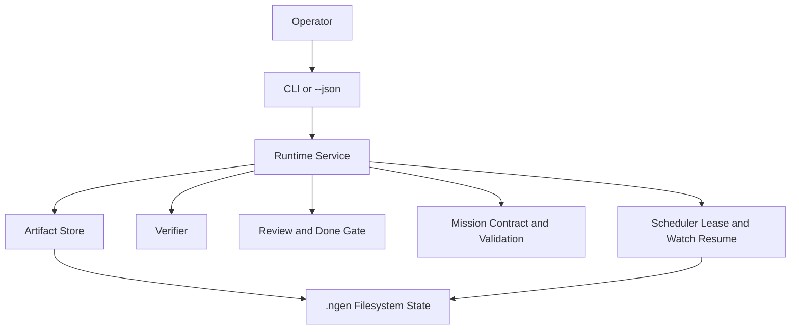

# 架构总览与数据流

## 1. 当前架构摘要

当前实现不是生产级完整自治 agent，而是一个带 post-foundation bridges 的 operator-assisted runtime。当前实现可以用以下组件理解：

1. CLI / headless JSON / TUI surface
2. Runtime service
3. Artifact store
4. Verifier pipeline
5. Review + completion gate
6. Provider adapter
7. ACP / terminal / TUI session bridge
8. Structured input request bridge
9. Workspace mission lane over project/task/worker/review artifacts

补充一个 workspace-level scheduler lease，用于 watch 恢复协调。

## 2. 当前责任边界

| 组件 | 当前职责 | 当前不负责 |
| --- | --- | --- |
| CLI / JSON surface | 解析命令，输出人类文本或结构化 JSON | 不拥有任务真相 |
| Runtime service | 推进 phase/state，驱动 create/run/resume/auto/review/watch/approval/input/session/worker/memory | 不拥有 task truth |
| Artifact store | 持久化 `.ngen/` 下的 JSON、JSONL、Markdown artifacts | 不做业务判定 |
| Verifier | 运行 `coding` 与 `docs_lite` 的 foundation verifier | 不决定 done gate |
| Review / gate | 检查 verifier、criteria 与 handoff，决定是否允许完成 | 不替代 runtime state owner |
| Mission lane | 持久化 validation contract、feature/milestone records 与 independent validation runs | 不绕过 root task verifier/review/done gate |

## 3. 当前组件图

## 4. 当前数据流

### 4.1 create -> run -> done / failed / blocked

1. `task create`
   - runtime 写 `task.json`、`plan.json`、`state.json`、`criteria/latest.json`、`sprint/latest.json`、`progress.md` 与初始 checkpoint。
2. `run` / `resume`
   - runtime 读取 durable task state。
   - 若 baseline 缺失，先写 `baseline.json`。
   - runtime 推进到 `Execute`，运行 foundation verifier。
   - runtime 写 `verification/latest.json`。
   - 对 `coding` task，runtime 还可以在同一 bounded pass 内先跑 observation command，再执行 patch-first workspace edit 与 bounded workspace repair command，然后重跑 verifier。
   - runtime 运行 review，写 `reviews/latest.json`、必要时写 `findings.jsonl`。
   - runtime 写 `handoff.md` 与 `completion/latest.json`。
3. 终态收敛
   - verifier 失败 -> `Failed/failed_verification`
   - review / done gate 阻塞 -> `Blocked/blocked_review`
   - gate 通过 -> `Done`

### 4.2 watch 唤醒

1. `watch set` 写 `.ngen/watches/<watch_id>.json` 并把 task 置为 `Waiting/waiting_watch`。
2. `scheduler tick --once` 取得 workspace scheduler lease。
3. scheduler 扫描 due watch，唤醒对应 task。
4. runtime 重新走 `resume` 路径。

### 4.3 structured input request

1. `input request` 或 ACP `input.request` 追加 `input_requests.jsonl` pending record。
2. runtime 把 task 置为 `Blocked/blocked_missing_input`。
3. operator 通过 `input respond` 或 ACP `input.respond` 写入 answered record。
4. runtime 清除 blocker，并允许后续 `resume` / `run` 继续。

### 4.4 mission create -> approve -> run -> validate

1. `mission create` 写 `.ngen/missions/<mission_id>/mission.json`、`validation_contract.json`、`features.json`、`milestones.json` 与 `notes.md`，创建或绑定 root task，并把 contract assertions 初始化为稳定 `ASSERT-*` ids。
2. `mission approve` 只读取 mission artifacts，确认每条 assertion 都被 feature 与 milestone 覆盖；成功时在 `mission.json` 写入 `plan_approval_status=approved` 与匹配当前 contract 的 `plan_approved_contract_ref`。
3. `mission run` 先执行 deterministic plan gate。未批准、批准引用不匹配当前 contract，或 coverage 不完整时只追加 blocking validation run，不进入 provider orchestration；gate 通过后才复用 root task truth，并按 `role_plan.orchestrator` 的 effective model 执行一轮 bounded provider-decision orchestration，再进入 root task gate 与 mission validation；mission-scope `task_create` 已收敛为 lineage-bound child materialization，只能绑定当前 mission feature，并且单次 pass 在创建一个 durable child task 后停止。
4. `mission validate` 读取 mission plan gate、root task `state.json`、`criteria/latest.json`、`completion/latest.json` 与 `harness/latest.json` 执行 deterministic gate；每个 assertion 还必须能回链 root task、worker、verifier、review、completion 或 validation evidence ref；显式 validators model 且 deterministic pass 通过时，再通过 dedicated read-only model validator 追加 `validation_runs.jsonl`。
5. approval / validation passed 时 mission 进入 approved / `done`；否则进入 `blocked_contract_coverage`、`blocked_plan_gate` 或 `blocked_validation` 并携带 evidence-backed findings。

## 5. 当前仍未实现的 richer hardening

richer child settle/reconcile、超出 builtin/command、OpenAI-compatible Chat Completions、OpenAI Responses 与 Anthropic Messages 的 broader provider matrix、dedicated browser computer-use plane，以及更深的 external-root / memory policy 仍未进入当前架构图。
